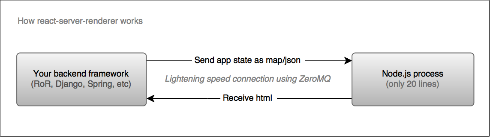

# react-server-renderer
Recommended architecture principles (*with implementation and config examples*) that allow you to do 
server-side rendering of React, no matter what language you choose for your backend.

#### Benefits
 1. **No need to use or manage embedded JavaScript engines** in your language. 
 Use a tidy local nodejs process instead.
 1. **Out-of-the-box scalability**. Turn that process into a remote load-balanced service in seconds.
 1. **No overhead from the communication protocol**. Make use of lower-level channels like IPC or TCP sockets, instead of the slower HTTP. And you don't need to implement messaging yourself, it's already handled.
 1. **No need to worry about keeping connection alive** or maintaining a pool of connections. 
 1. **Fully replace your template engine with React**. Finally use a single technology 
 for generating html, thus making your view layer language-agnostic, modular 
 and naturally having just one codebase for both client and server.
 - ...*[other](#server-side-rendering-others)*

## How it works?



Your framework takes care of building the state, ZeroMQ takes care
of the communication and the tiny nodejs server takes care of 
the rendering.

If you want to know [why do it this way](#why) or you just want to 
read more on the topic before getting started, see [the background](#why).

 

## Getting started

#### renderer
Your tiny javascript process:

```js
const zmq = require('zmq');
const renderToString = require('react-dom/server').renderToString;
const App  = require('components/app').App; // replace this with your root component
const Helmet = require("react-helmet");
const channel = zmq.socket('rep');
const [doctype, constantHead, endOfBody] = require('index.html').split(/<html.+<head>|<!--REACT-->/);

channel.connect('ipc:///tmp/myapp');
channel.on('message', state => {
    state = JSON.parse(state);
    let content = renderToString(<App state={state}></App>);
    let head = Helmet.rewind();
    channel.send(`
        ${doctype}<html ${head.htmlAttributes.toString()}><head>
        ${head.title.toString()}
        ${head.meta.toString()}
        ${head.link.toString()}
        ${constantHead}${content}${endOfBody}
    `);
});
```

This will generate the complete html. One of the core ideas in 
`react-server-renderer` is to ditch your template 
language when generating html. No more Thymeleaf, Jinja, HAML, Twigs, ERB, ... etc. 
For more info see [the benefits of JSX being your only template language](#why-jsx-only).

#### systemd
You want to keep this script running with something like [`systemd`](https://en.wikipedia.org/wiki/Systemd):
```
[Unit]
Description=React server rendering service

[Service]
ExecStart=node /path/to/tiny/server/renderer.js
Restart=always
StandardOutput=syslog
StandardError=syslog
SyslogIdentifier=react-server-renderer
User=www-data
Group=www-data
Environment=NODE_ENV=production

[Install]
WantedBy=multi-user.target
```
> *located at ` /etc/systemd/system/react-server-renderer.service`* and started via:
> ```
> systemctl enable react-server-renderer
> systemctl start react-server-renderer
> ```

#### render
From then on you just pass data to it from your backend: *(the example is 
in Python but [your can use your favourite language](#languages))*
```py
import zmq
channel = zmq.Context.instance().socket(zmq.REQ)
channel.bind('ipc:///tmp/myapp')

def render(state):
    channel.send_string(state)
    return channel.recv()
```

#### state
Instead of dealing with html, your backend will generate a state tree (`json` object) 
for the renderer. You can and should use all your handy template helpers while doing so:

```py
from render import render
from template_helpers import url_to

def todo_controller(request, todo_id):
    # ... get current todo
    return render({
        "user_id": request.user.id,
        "list_url": url_to('todo_list')
        "todo": {
            "id": todo.id,
            "url": url_to('todo', id=todo.id)
            "category": todo.category.id
        },
        "_links": {
            "main": [...] # used in menu
            "secondary": [...] # used in footer
        },
        "categories": ... 
        ...
    })
```

Most likely you would want to break down the process of state building,
so that things like `"_links"` which are the same for all controllers,
are added outside them.

#### done.
**That's it**. You can now render `React` on the server-side having a clean,
high-performance setup. You can also scale it simply by launching another 
worker of the the same tiny js script. No need to change anything. 

Want to run it on a separate server? - *no problem!* Just change `ipc:///tmp/myapp`
to the address of your server:`tpc://192.168.0.2`. Everything else stays the same.


<a name="why"></a>
### Why do it this way? *(background)*
Rendering React is something that needs to be done in a JavaScript.
Some languages offer embedded JavaScript engine/interpreter. Examples
of that are the Ruby's `therubyracer` or Java's `Nashorn`. So it begs 
the question: **Why node?**

1. Embedding execution of one language in another 
introduces tight coupling which is a stopper for scalability. 
In fact, in relation to react rendering, even applications written
in node [are faced with](https://github.com/erikras/react-redux-universal-hot-example/issues/368)
[bottlenecks](https://github.com/facebook/react/issues/1739) 
when doing it.
2. Nodejs is the defacto standard for running JavasScript on the server - the npm ecosystem,
the speed of its development, the community. Any alternatives, no 
matter how similar, are bound to run into differences, 
and you have to account for them.
3. Any javascript packages intended to run on the server are most
likely to support node first, or even only node.

Making the rendering of html external from our main app
introduces another problem: **How to communicate with it**? HTTP 
is the default choice across other libraries and examples on the web.
A couple of things to note:
1. HTTP is a protocol which relies on TCP. It is an additional layer
 which needs parsing for it's structure (body, headers, etc.). You 
 don't need any of this for rendering `React`. You just need to pass the state, 
 which is a single json object.
1. Lower-level communication like using IPC or TCP sockets require some
 work, like buffering, defining message boundaries and cleanup. It will be 
 nice if that is already taken care of and available to multiple languages.
 
ZeroMQ is solves the problems above. If you want to write your own solution,
you can do that too. Just keep in mind that ZeroMQ has bindings for many
languages, plus documentation and community around it, so it's safer for projects
that involve collaboration or outsourcing. 


<a name="why-jsx-only"></a>
### Benefits of using JSX as the only template language

1. JSX already is a template language and your client-side logic is already using it. 
So keep it simple, don't introduce another template language.
1. Even if you limit what your backend generates as html, like only generating
an html with `<head>` and empty `<body>`, than you make your backend 
aware of unnecessary stuff like how to generate the correct title for each page,
or how to generate meta tags and where are your js and css files. You already
do this logic on the client-side with `React` and the [`<Helmet/>` component](#)
when switching `<SomethingPage/>` components. So, adhere to the DRY principle. 
1. An opinionated argument would be that JSX is a very good way to build 
your markup and describe its requirements. Passing data to components via 
properties is much cleaner than calling helpers like 
`` or some custom
 tag generator like ``.

<a name="server-side-rendering-others"></a>
## Other usefulness of server-side rendering
Server-side rendering also relates to SEO for old or crappy search engines 
that can't handle javascript. You **shouldn't be doing it** if you just want
Google and Bing to index you.

In rare cases you might want server-side rendering because someone is using 
a custom scraper to check if certain links/elements exist in your web pages. 
That might happen for blogs, news outlets or similar affiliate-dependent apps. 

<a name="languages"></a>
## List of supported languages
This is an just an extract of existent ZeroMQ bindings. 
For a up-to-date list visit [the official ZeroMQ website](http://zeromq.org/bindings:_start), 
although others may exist on github.

 - Ada 
 - Bash 
 - Basic 
 - C 
 - C++ 
 - C# (.NET & Mono) 
 - Chicken Scheme 
 - Common Lisp 
 - D 
 - delphi 
 - Eiffel 
 - Erlang 
 - F# 
 - Felix 
 - Flex (ActionScript) 
 - Fortran77 
 - Guile 
 - Haskell 
 - Haxe 
 - Java 
 - JavaScript (Flash) 
 - Julia 
 - LabVIEW 
 - Lua bindings 
 - Metatrader 4 
 - Nimrod 
 - Node.js 
 - Objective Caml 
 - Objective-C 
 - ooc 
 - Perl Bindings 
 - PHP 
 - Python 
 - Q 
 - R 
 - R (pbdR) 
 - Racket 
 - REBOL 2 
 - REBOL 3 
 - Red 
 - Ruby 
 - Ruby (FFI) 
 - Scala 
 - Smalltalk 
 - Swift 
 - Tcl 
 - Twisted (Python) Bindings 
 - XPCOM
 
 ## Plans
 - Monitor [nanomsg](http://nanomsg.org/) and replace ZeroMQ with it once it matures.
 
